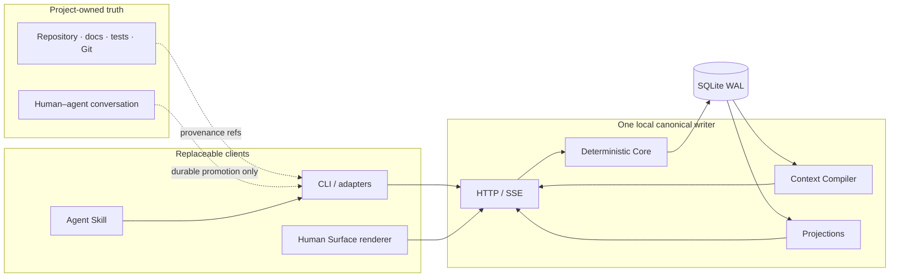

# Espalier

[简体中文](README.zh-CN.md) · English

Espalier is a local-first coordination and authority layer for long-running human–agent projects. It keeps the small amount of durable project meaning that repositories, chats, issue trackers, and agent memory usually lose between them: the approved goal, current work topology, claims, decisions, evidence, handoffs, relations, and bounded return context.

It is designed for a responsible owner who wants several agents or sessions to work without turning machine output into authority, reading every full report, or losing the reasons behind a decision.

> **Status:** developer preview, ready for bounded local dogfood. The deterministic Core, CLI, Codex Skill, loopback service, projections, canonical live Canvas reader, and first real single-agent checkpoint/handoff loop are working. Fresh-session and multi-agent dogfood, authenticated remote deployment, production-grade Human Surface evidence, and final product acceptance are still open.

## Why it exists

A repository can tell you what changed. A chat can tell you what one agent said. An issue tracker can list tasks. None of them reliably answers all of these questions at once:

- What goal and constraints are currently binding?
- Which work is active, blocked, deferred, research-only, or awaiting a human judgment?
- Which agent has the right to write a semantic surface right now?
- What changed since I last looked, and what routine activity should stay quiet?
- What is evidence, what has been verified, and what has actually been accepted?
- Can a new session resume without receiving the entire chat or a hand-written briefing?

Espalier stores those answers as explicit, revisioned project semantics and compiles only the bounded context needed by a person, agent, or renderer.

## What Espalier is — and is not

| Espalier is | Espalier is not |
| --- | --- |
| A coordination and authority substrate beside the project | A replacement for Git, project documents, tests, or the project database |
| A sparse semantic event log and current project projection | An agent activity feed, token monitor, or transcript archive |
| A bounded context compiler for returning agents | A second hidden memory system that silently copies the repository |
| A place for exact Claims, Decisions, Evidence, Relations, and Handoffs | A generic approve/reject dashboard that makes conversation unnatural |
| A renderer-neutral source for a Canvas / Map Human Surface | A conventional mind map whose geometry becomes project authority |
| Local-first and user-owned by default | A hosted multi-user service or remotely authenticated deployment today |

The project repository remains authoritative for source, schema, tests, Git history, and formal documents. Espalier records coordination state and provenance references to those sources; it does not duplicate or reinterpret them as truth.

## Where it helps

Espalier is most useful when ordinary chat and issue lists begin to collapse under project complexity:

- **Long-running agent work:** a new session recovers the current goal, exact Work item, recent meaningful delta, and next safe action from a bounded brief.
- **Parallel development:** Claims and semantic/repository surfaces make overlapping writers and integration pressure visible without pretending to solve Git conflicts.
- **Spec and architecture review:** alternative branches, constraints, evidence, unresolved decisions, and owner boundaries can be visualized without asking a human to read every generated report.
- **Human judgment:** mechanical evidence, implementation completion, aesthetic acceptance, legal/rights clearance, and publication approval remain distinct.
- **Portfolio orientation:** several projects retain independent authority domains while explicit cross-project Relations remain inspectable.

Espalier is probably unnecessary for a short, single-session task with one obvious owner and no durable handoff or authority ambiguity. In that case it should stay dormant.

## Current capabilities

| Area | Available now |
| --- | --- |
| Semantic model | Projects, Goal revisions, Epochs, Work, Relations, Decisions, Hypotheses, Claims, Evidence, Annotations, Handoffs, Batches, and Lanes |
| Authority | Owner policies, exact single-use authorization for binding actions, version checks, stale-write rejection, and explicit proposal boundaries |
| Coordination | Primary/coordinator/observer Claims, leases, overlap warnings, Batch/Lane returns, integration, and structured handoffs |
| Context | Deterministic presence/task/delta briefs with hard budgets, omission counts, expansion refs, and typed undersized-budget failures |
| References | Stable current and revision-qualified `espalier://...` refs, compact aliases, historical Focus, search, and CJK substring fallback |
| Persistence | SQLite WAL, append-only accepted events, materialized state, FTS, replay, backup, portable export, and empty-domain restore |
| Human Surface input | Renderer-neutral Live, Focus, Attention/Decisions, Atlas, Portfolio, meaningful delta, operational summaries, Relation bundles, and bounded historical replay |
| Interfaces | Local HTTP/JSON API, SSE invalidation, TypeScript client, CLI, and an installable Codex Skill |
| Safety boundary | Loopback-only binding, Host/Origin checks, JSON-only writes, and a per-process local mutation token |

The complete command and projection contracts live in [`packages/protocol`](packages/protocol/src/index.ts), [`packages/core`](packages/core/src/), [`packages/context-compiler`](packages/context-compiler/src/), and [`packages/projections`](packages/projections/src/).

## Five-minute source run

Requirements:

- Node.js 24 or newer;
- npm 11 or newer;
- macOS or Linux;
- no hosted database, model API key, or third-party account.

```bash
git clone https://github.com/IndelibleVivi/espalier.git
cd espalier
npm ci
npm run build
npm run seed
npm run service:start
npm run service:status
```

Open <http://127.0.0.1:4317/> in a browser. The neutral Orchard seed is synthetic contract data for local inspection; it is not a real project import. The managed source process survives terminal closure but is not installed as a reboot/login service. See the getting-started guide for status, restart, foreground debugging, isolated data, and clean shutdown.

The Web app is the canonical local live Canvas reader over the real Human Surface projection contract. It discovers the sole Project owned by the service (or accepts `?project=<id>` when several are present), keeps source-authored content unchanged across `EN / 中文`, and stores camera/selection/collapse as local view state. It is a developer renderer, not a claim of production accessibility, performance, or final visual acceptance.

## Install the Codex harness

The repository contains both halves of the local Codex integration:

- the `espalier` CLI for discovery, bounded reads, Claims, checkpoints, and handoffs;
- the canonical [`espalier` Skill](skills/espalier/SKILL.md), which tells an agent when to remain Dormant, become Aware, or participate.

Preview and install them together:

```bash
npm run install:codex -- --dry-run
npm run install:codex
```

The installer links the source CLI and transactionally installs the Skill under the current Codex home, preserving the previous copy in a backup and writing a file-digest manifest. Open a fresh Codex task after installation so Skill discovery reloads.

## Enroll a project

Enrollment maps a repository root to one Espalier Project and one local service. It does not add a marker to the repository and does not grant remote identity or authority.

With the canonical service running:

```bash
espalier link /path/to/project \
  --project orchard \
  --name "Orchard" \
  --purpose "Ship the approved programme without losing owner decisions" \
  --principal owner-name

cd /path/to/project
espalier doctor --compact
espalier join --budget 900 --compact
```

When the Project does not yet exist, `link --purpose` creates an explicit thin seed: Project, approved Goal revision, and initial Epoch. It does not invent Work, import Git history, or treat repository state as accepted semantic state.

## The everyday agent loop

An enrolled agent should be quiet by default:

```text
doctor → bounded brief → inspect exact refs
       → claim only before semantic writes
       → do ordinary repository work normally
       → publish only durable checkpoints
       → handoff and release when leaving work
```

Typical commands:

```bash
espalier doctor --compact
espalier join --budget 900 --compact
espalier brief <work-ref> --budget 1400 --since <revision>
espalier inspect <stable-ref>
espalier search "owner decision"
espalier changes --since <revision>
espalier claim <work-ref> --lease 900
espalier annotate <stable-ref> --kind concern --body "..."
espalier handoff <work-ref> --state "..." --next "..."
espalier release <work-ref>
```

Routine file reads, shell commands, tests, token usage, and repeated progress messages are not Espalier events. Evidence records observation; it does not automatically verify Work or grant owner acceptance.

See [Getting started](docs/getting-started.md) for the complete first-project walkthrough and [Agent operating guide](docs/agent-guide.md) for exact sparse-checkpoint examples.

## Architecture and trust boundary



Only Core commands mutate canonical semantic state. Geometry, camera, density, collapse, theme, and personal layout remain view state. A project has one writable canonical service; do not file-sync writable SQLite databases between hosts.

The current local token is containment and browser-CSRF resistance, not proof of actor identity. The executable refuses non-loopback binding. Do not place it behind a LAN address, tailnet, tunnel, reverse proxy, or public hostname until an authenticated deployment adapter derives actor identity and effective capabilities server-side.

Read [Security](SECURITY.md) before using real project data.

## Project status

Espalier is not a finished release. The following remain open:

- production-grade Human Surface accessibility/performance evidence and final owner/aesthetic acceptance;
- fresh-session recovery and parallel multi-agent dogfood over a longer real task;
- authenticated remote or mutually untrusted multi-principal deployment;
- managed cross-device continuity, scheduled retention, and attachment storage;
- packaging and distribution beyond the source-linked local developer harness.

See [Public status](docs/status.md) for a concise current capability/limitation matrix. Internal experimental evidence and private project continuity are not part of the public documentation contract.

## Documentation

- [Documentation map](docs/README.md)
- [Getting started](docs/getting-started.md)
- [Product guide](docs/product-guide.md)
- [Agent operating guide](docs/agent-guide.md)
- [Public status](docs/status.md)
- [Security](SECURITY.md)
- [Contributing](CONTRIBUTING.md)

## Verification

```bash
npm run check
npm run test:coverage
npm run smoke:process
npm run stress:scale-replay
```

`npm run check` includes typecheck, type-aware lint, package-boundary validation, all tests, the Web build, canonical Skill validation, and the tracked public-surface guard. GitHub Actions adds Node 24/26 lanes, pinned workflow tooling, secret scanning, workflow audits, canonical/deterministic-contract coverage receipts, and exact-commit review bundles. React renderer acceptance remains a separate rendered-Browser gate; it is not misrepresented as Node unit coverage. A green source or CI gate is engineering evidence; it is not release, deployment, or owner acceptance.

## Licensing

Espalier uses a mixed, path-scoped license model:

- project-original functional source and the installable Skill: [`SUL-1.0`](LICENSE), a source-available license with use and distribution restrictions, not an OSI-approved open-source license;
- covered original documentation: [`CC BY-NC-SA 4.0`](LICENSE-DOCUMENTATION.md); and
- dependencies: their own upstream terms.

Read the exact [`LICENSING.md`](LICENSING.md) path map and [`THIRD_PARTY_NOTICES.md`](THIRD_PARTY_NOTICES.md) before reuse. Private incubator history and excluded dogfood material are not part of the public grant.
