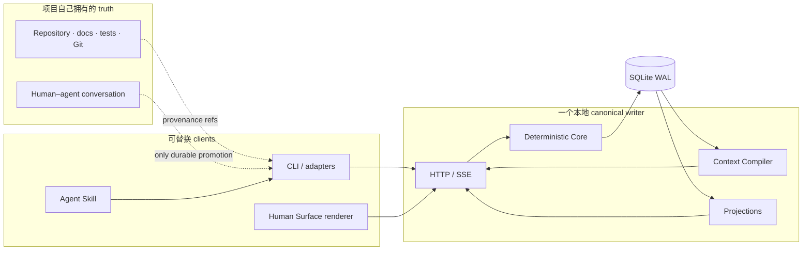

# Espalier

简体中文 · [English](README.md)

Espalier 是一个面向长期人机协作项目的 local-first 协调与权限语义层。它保存那些经常散落在 repo、聊天、issue tracker 与 agent memory 之间、却真正决定项目能否被可靠接续的少量持久语义：已批准目标、当前工作拓扑、Claim、Decision、Evidence、Handoff、Relation，以及有预算上限的返回上下文。

它服务的是希望负责任地使用多个 agent / session 的项目 owner：不把机生成的内容自动变成 authority，不要求人阅读每一份全量报告，也不让决定背后的理由随着聊天窗口消失。

> **当前状态：** developer preview，已可进行有边界的本地 dogfood。确定性的 Core、CLI、Codex Skill、loopback service、projection、canonical live Canvas reader，以及第一轮真实单 agent checkpoint / handoff 已经跑通。Fresh-session 与 multi-agent dogfood、远程身份验证部署、production-grade Human Surface evidence 和最终产品验收仍未完成。

## 为什么需要它

Repo 能告诉你代码发生了什么变化；聊天能告诉你某一只机说了什么；issue tracker 能列出任务。它们通常无法同时回答：

- 当前真正 binding 的目标与约束是什么？
- 哪些工作 active、blocked、deferred、research-only，或者正在等人判断？
- 现在谁有权写哪一块 semantic surface？
- 我离开之后发生了什么 meaningful change，哪些 routine activity 应该保持安静？
- 什么只是 Evidence，什么已经 verified，什么才真正 accepted？
- 新 session 能否在不接收整段聊天或人工 briefing 的情况下恢复工作？

Espalier 把这些答案记录为明确、带 revision 的项目语义，再只为人、agent 或 renderer 编译当下需要的 bounded context。

## Espalier 是什么，又不是什么

| Espalier 是 | Espalier 不是 |
| --- | --- |
| 位于项目侧翼的协调与权限语义底座 | Git、正式文档、测试或项目数据库的替代品 |
| 稀疏 semantic event log 与当前项目 projection | agent activity feed、token 监控器或聊天存档 |
| 为返回的 agent 编译 bounded context 的工具 | 悄悄复制整个 repo 的第二套隐藏 memory |
| 精确保存 Claim、Decision、Evidence、Relation 与 Handoff 的地方 | 迫使人勾选 approve/reject 的通用审批后台 |
| Canvas / Map Human Surface 的 renderer-neutral 输入 | 把几何位置当成项目 authority 的普通 mind map |
| 默认 local-first、数据归用户所有 | 现阶段的 hosted multi-user service 或远程认证部署 |

项目 repo 仍然拥有 source、schema、tests、Git history 和正式文档的 authority。Espalier 只保存协调状态与指向这些来源的 provenance refs，不复制它们，也不把观察自动解释成 truth。

## 适合的使用场景

当普通聊天和任务列表开始承受不了项目复杂度时，Espalier 才真正有价值：

- **长期 agent 开发：** 新 session 从 bounded brief 恢复当前目标、精确 Work、最近 meaningful delta 与 next safe action。
- **并行开发：** Claim 与 semantic/repo surfaces 暴露重叠写入和 integration pressure，但不假装替你解决 Git conflict。
- **Spec / architecture 阅读：** 把并行方案、约束、Evidence、未决判断与 owner boundary 放在同一语义空间，人不必读完每份机生成报告。
- **人类判断：** 机械证据、实现完成、审美验收、法律/rights closure 和 publication approval 始终是不同边界。
- **多项目定位：** 每个项目保留独立 authority domain，同时允许明确的 cross-project Relation。

如果只是一个短小、单 session、owner 清楚且不需要 durable handoff 的任务，Espalier 很可能没有必要；它应该保持 Dormant。

## 当前 capabilities

| 区域 | 现在已经具备 |
| --- | --- |
| Semantic model | Project、Goal revision、Epoch、Work、Relation、Decision、Hypothesis、Claim、Evidence、Annotation、Handoff、Batch 与 Lane |
| Authority | Owner policy、binding action 的精确 single-use authorization、version check、stale-write rejection 与明确 proposal boundary |
| Coordination | Primary/coordinator/observer Claim、lease、overlap warning、Batch/Lane return、integration 与结构化 Handoff |
| Context | 有硬预算、omission count、expansion ref 与 typed undersized-budget failure 的确定性 presence/task/delta brief |
| References | 稳定与 revision-qualified `espalier://...` refs、compact alias、historical Focus、search 与 CJK substring fallback |
| Persistence | SQLite WAL、append-only accepted events、materialized state、FTS、replay、backup、portable export 与 empty-domain restore |
| Human Surface input | Renderer-neutral Live、Focus、Attention/Decisions、Atlas、Portfolio、meaningful delta、operational summary、Relation bundle 与 bounded historical replay |
| Interfaces | 本地 HTTP/JSON API、SSE invalidation、TypeScript client、CLI 与可安装 Codex Skill |
| Safety boundary | 仅 loopback binding、Host/Origin 检查、只接受 JSON 写入，以及 per-process local mutation token |

完整 command 与 projection contract 位于 [`packages/protocol`](packages/protocol/src/index.ts)、[`packages/core`](packages/core/src/)、[`packages/context-compiler`](packages/context-compiler/src/) 和 [`packages/projections`](packages/projections/src/)。

## 五分钟从源码运行

要求：

- Node.js 24 或更新版本；
- npm 11 或更新版本；
- macOS 或 Linux；
- 不需要 hosted database、model API key 或第三方账号。

```bash
git clone https://github.com/IndelibleVivi/espalier.git
cd espalier
npm ci
npm run build
npm run seed
npm run service:start
npm run service:status
```

浏览器打开 <http://127.0.0.1:4317/>。中性的 Orchard seed 只创建用于本地检查的 synthetic contract data，不是对真实项目的导入。Managed source process 关闭 terminal 后仍继续运行，但不会自动注册为 reboot/login service；status、restart、foreground debug、isolated data 与 clean shutdown 见快速开始。

Web app 是建立在真实 Human Surface projection contract 上的 canonical local live Canvas reader。Service 仅有一个 Project 时它会自动发现；有多个时用 `?project=<id>` 显式选择。`EN / 中文` 只改 renderer chrome，source-authored content 保持原样；camera / selection / collapse 只是 local view state。这仍是 developer renderer，不代表 production accessibility、performance 或最终视觉验收已经完成。

## 安装 Codex harness

Repo 同时包含本地 Codex integration 的两半：

- `espalier` CLI：用于发现 enrollment、读取 bounded context、Claim、checkpoint 与 Handoff；
- canonical [`espalier` Skill](skills/espalier/SKILL.md)：告诉 agent 什么时候保持 Dormant、什么时候 Aware、什么时候真正 Participating。

先预览，再一起安装：

```bash
npm run install:codex -- --dry-run
npm run install:codex
```

Installer 会链接 source CLI，并 transactionally 安装 Skill：旧副本进入 backup，当前副本写入带 file digests 的 manifest。安装后必须打开一个新的 Codex task，Skill discovery 才会重新加载。

## Enroll 一个项目

Enrollment 把一个 repo root 映射到一个 Espalier Project 与一个本地 service。它不会向 repo 写 marker，也不会授予远程身份或 authority。

Canonical service 运行时：

```bash
espalier link /path/to/project \
  --project orchard \
  --name "Orchard" \
  --purpose "Ship the approved programme without losing owner decisions" \
  --principal owner-name

cd /path/to/project
espalier doctor --compact
espalier join --budget 900 --compact
```

如果 Project 尚不存在，`link --purpose` 会创建一个明确的 thin seed：Project、approved Goal revision 和 initial Epoch。它不会自行发明 Work、导入 Git history，或者把 repo 当前状态视为 accepted semantic state。

## 日常 agent loop

一个已 enrollment 的 agent 默认应该保持安静：

```text
doctor → bounded brief → inspect 精确 refs
       → 只在 semantic write 前 Claim
       → 普通 repo 工作照常进行
       → 只发布 durable checkpoint
       → 离开 Work 时 Handoff + Release
```

常用命令：

```bash
espalier doctor --compact
espalier join --budget 900 --compact
espalier brief <work-ref> --budget 1400 --since <revision>
espalier inspect <stable-ref>
espalier search "owner decision"
espalier changes --since <revision>
espalier claim <work-ref> --lease 900
espalier annotate <stable-ref> --kind concern --body "..."
espalier handoff <work-ref> --state "..." --next "..."
espalier release <work-ref>
```

普通读文件、shell command、test、token usage 与重复进度消息都不是 Espalier event。Evidence 只记录观察；它不会自动 verify Work，也不会替 owner 完成 acceptance。

完整 first-project walkthrough 见[快速开始](docs/zh-CN/getting-started.md)，精确 sparse-checkpoint 示例见[Agent 操作指南](docs/zh-CN/agent-guide.md)。

## Architecture 与 trust boundary



只有 Core command path 能修改 canonical semantic state。Geometry、camera、density、collapse、theme 与 personal layout 都只是 view state。一个 Project 只能有一个 writable canonical service；不要在 hosts 之间 file-sync 可写的 SQLite database。

当前 local token 提供的是 containment 与 browser-CSRF resistance，不是 actor identity proof。Executable 会拒绝 non-loopback binding。在 server-side authenticated adapter 能派生 actor identity 和 effective capabilities 之前，不要把它放到 LAN、tailnet、tunnel、reverse proxy 或 public hostname 后面。

在处理真实项目数据前，请阅读[安全说明](SECURITY.zh-CN.md)。

## 项目状态

Espalier 还不是 finished release。以下事项仍然开放：

- production-grade Human Surface accessibility/performance evidence 与最终 owner / aesthetic acceptance；
- 更长真实任务上的 fresh-session recovery 与 parallel multi-agent dogfood；
- authenticated remote / mutually untrusted multi-principal deployment；
- managed cross-device continuity、scheduled retention 与 attachment storage；
- source-linked local developer harness 之外的 packaging 与 distribution。

简明 capability/limitation matrix 见[公开状态](docs/zh-CN/status.md)。内部实验 evidence 与私人项目 continuity 不属于 public documentation contract。

## 文档

- [文档地图](docs/zh-CN/README.md)
- [快速开始](docs/zh-CN/getting-started.md)
- [产品指南](docs/zh-CN/product-guide.md)
- [Agent 操作指南](docs/zh-CN/agent-guide.md)
- [公开状态](docs/zh-CN/status.md)
- [安全说明](SECURITY.zh-CN.md)
- [贡献指南](CONTRIBUTING.zh-CN.md)

## Verification

```bash
npm run check
npm run test:coverage
npm run smoke:process
npm run stress:scale-replay
```

`npm run check` 包含 typecheck、type-aware lint、package-boundary validation、全部 tests、Web build、canonical Skill validation 与 tracked public-surface guard。GitHub Actions 另外运行 Node 24/26、pinned workflow tooling、secret scan、workflow audit、canonical / deterministic-contract coverage receipt 与 exact-commit review bundle。React renderer acceptance 仍是单独的 rendered-Browser gate，不会被冒充成 Node unit coverage。绿色 source/CI gate 是 engineering evidence，不等于 release、deployment 或 owner acceptance。

## Licensing

Espalier 使用按 path 划分的 mixed-license model：

- project-original functional source 与可安装 Skill：[`SUL-1.0`](LICENSE)，它是带使用与分发限制的 source-available license，不是 OSI-approved open-source license；
- 受覆盖的原创 documentation：[`CC BY-NC-SA 4.0`](LICENSE-DOCUMENTATION.md)；
- dependencies：继续适用各自 upstream terms。

复用前请阅读精确的 [`LICENSING.md`](LICENSING.md) path map 与 [`THIRD_PARTY_NOTICES.md`](THIRD_PARTY_NOTICES.md)。Private incubator history 与被排除的 dogfood material 不在这次 public grant 内。
